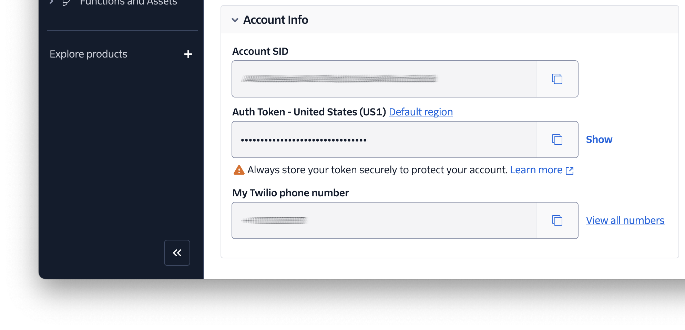
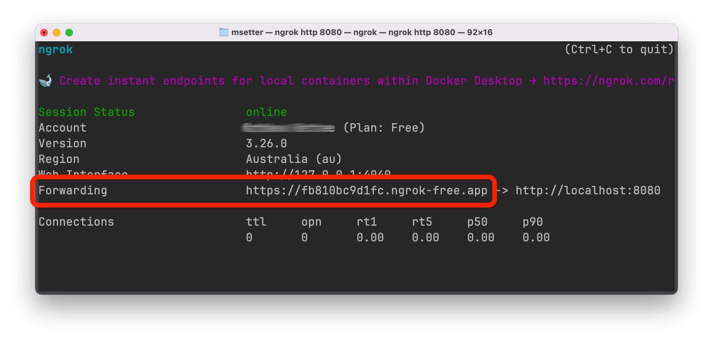

<!-- markdownlint-disable MD013 -->
# Call Forwarding with Voicemail

This is a small Go app that shows how to forwards calls during a specific time window, and how to record voicemails if calls are unanswered, or are received outside that time window.

Find out more on [Twilio Code Exchange][code-exchange-url].

## Application Overview

The application forwards incoming calls to a specified number during business hours; by default, these are Monday to Friday 8:00-18:00 UTC.
Otherwise, it directs the call to voicemail.
If the call is directed to voicemail, a message can be recorded and a link of the recording sent via SMS to the configured phone number.

## Requirements

To use the application, you'll need the following:

- [Go][go-url] 1.22 or above
- A Twilio account (free or paid) with a phone number. [Click here to create a free account][try-twilio-url], if you don't have already.
- [ngrok][ngrok-url]
- Two phone numbers; one to call the service and another to redirect your call to, if it's between business hours.

## Getting Started

After cloning the code to wherever you store your Go projects, and change into the project directory.
Then, copy _.env.example_ as _.env_, by running the following command:

```bash
cp -v .env.example .env
```

After that, set values for `TWILIO_ACCOUNT_SID`, `TWILIO_AUTH_TOKEN`, `TWILIO_PHONE_NUMBER`.
You can retrieve these details from the **Account Info** panel of your [Twilio Console][twilio-console-url] dashboard.



Then, set `MY_PHONE_NUMBER` to the [E.164-formatted phone number][twilio-docs-e164-format-url] that you want to receive SMS notifications.

> [!NOTE]
> Feel free to uncomment and adjust the commented out configuration details if desired.
> However, you don't need to change them if you don't want to.

### Launch the Application

When that's done, run the following command to launch the application:

```php
go run main.go
```

Then, use ngrok to create a secure tunnel between port 8080 on your local development machine and the public internet, making the application publicly accessible, by running the following command.

```php
ngrok http 8080
```



### Use the application

With the application ready to go, make a call to your Twilio phone number.

## Contributing

If you want to contribute to the project, whether you have found issues with it or just want to improve it, here's how:

- [Issues][github-issues-url]: ask questions and submit your feature requests, bug reports, etc
- [Pull requests][github-pr-url]: send your improvements

## Resources

Find out more about the project on [CodeExchange][code-exchange-url].

## Did You Find The Project Useful?

If the project was useful and you want to say thank you and/or support its active development, here's how:

- Add a GitHub Star to the project
- Write an interesting article about the project wherever you blog

<!-- Page links -->
[code-exchange-url]: https://www.twilio.com/code-exchange/call-forwarding-voicemail
[github-issues-url]: https://github.com/twilio-samples/call-forwarding-voicemail-go/issues
[github-pr-url]: https://github.com/twilio-samples/call-forwarding-voicemail-go/pulls
[go-url]: https://go.dev/doc/install
[ngrok-url]: https://ngrok.com/
[try-twilio-url]: http://www.twilio.com/try-twilio
[twilio-console-url]: https://console.twilio.com/
[twilio-docs-e164-format-url]: https://www.twilio.com/docs/glossary/what-e164
<!-- markdownlint-enable MD013 -->